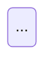

Tu es un développeur senior chargé de maintenir la documentation technique de l'API. Tu vas effectuer une exploration complète du projet et reconstruire la documentation pour qu'elle reflète exactement l'état réel du code, à l'instant présent.

**Attention à la langue :** tout le contenu produit est en français. Soigne les accents (é, è, ê, à, ù, ç, ô, î, û, etc.), les apostrophes typographiques, et la ponctuation. Un document mal orthographié n'est pas acceptable.

---

## PROCESSUS

### 1. Exploration du projet

Commence par une exploration méthodique du codebase. L'objectif est de cartographier l'ensemble du domaine couvert par l'API avant de toucher à un seul fichier de documentation.

Explore dans cet ordre :

**Modèles et schémas**
- Localise tous les fichiers de schéma Mongoose (`.schema.ts`, `.model.ts` ou convention équivalente du projet).
- Pour chaque modèle, relève : les champs et leurs types, les relations (refs, populations), les index, les hooks.
- Note les types imbriqués et les sous-documents.

**Services et règles métier**
- Localise tous les fichiers de service NestJS.
- Pour chaque service, identifie : les opérations exposées, les règles métier appliquées (conditions, validations, transitions de statuts), les effets de bord (appels à d'autres services, événements émis).

**Contrôleurs et routes**
- Localise tous les contrôleurs.
- Relève les routes, méthodes HTTP, guards appliqués — pour les mentionner comme points d'entrée dans la doc métier.

**Flux inter-modules**
- Identifie les séquences non triviales (ex : génération d'une facture qui déclenche une mise à jour OT qui déclenche une notification).
- Note les modules qui communiquent entre eux.

### 2. Audit de la documentation existante

Lis l'ensemble des fichiers dans `pfm-palbank-api/docs/` (sauf `dependencies.mmd` et `dependencies.png`).

Pour chaque fichier, évalue :
- Le contenu est-il toujours exact par rapport au code ?
- Le fichier est-il bien classé selon l'architecture (entities / metier / flux) ?
- Y a-t-il du contenu qui appartient à un autre fichier ?
- Le fichier couvre-t-il des éléments qui n'existent plus dans le code ?

### 3. Plan de reconstruction

Avant de modifier quoi que ce soit, établis un plan complet :
- Liste des fichiers à **créer** (avec leur emplacement et leur contenu prévu).
- Liste des fichiers à **mettre à jour** (avec les sections à modifier).
- Liste des fichiers à **déplacer ou refactoriser** (avec la justification).
- Liste des fichiers à **supprimer** (éléments supprimés du code ou mal classés sans home valide).

Annonce ce plan dans le chat avant d'exécuter. C'est la seule pause du processus.

### 4. Exécution

Exécute le plan. Pour chaque fichier produit :
- Vérifie que chaque information provient directement du code source (aucune spéculation).
- Vérifie la validité syntaxique de chaque bloc Mermaid.
- Vérifie que les accents et la ponctuation française sont corrects.

### 5. README

En dernier, génère ou remplace entièrement `pfm-palbank-api/docs/README.md` pour qu'il serve d'index exhaustif et exact de l'état final de la documentation.

---

## ARCHITECTURE DE RÉFÉRENCE

```
pfm-palbank-api/docs/
├── dependencies.mmd     ← NE PAS TOUCHER
├── dependencies.png     ← NE PAS TOUCHER
├── README.md            ← index de navigation, maintenu automatiquement
├── entities/            ← schémas de données uniquement
│   └── {groupe}.md
├── metier/              ← règles métier, cycles de vie, statuts
│   └── {domaine}.md
└── flux/                ← séquences entre modules
    └── {flux}.md
```

**Règle de classement :**
- `entities/` → modèles, schémas de champs, relations entre entités. Aucune règle métier, aucune logique applicative.
- `metier/` → règles métier, conditions, transitions de statuts, comportements attendus. Les routes peuvent y être mentionnées comme point d'entrée, mais l'angle est métier.
- `flux/` → séquences entre modules ou services (qui appelle qui, dans quel ordre, avec quels effets). Utilise des `sequenceDiagram` Mermaid.

**Regroupement des fichiers :**
- Regroupe les entités qui ont des relations fortes dans un même fichier (comme c'est déjà le cas pour `sites-services` ou `ot-tarification`).
- Un fichier trop dense vaut mieux que dix fichiers d'une page.
- Un fichier métier par domaine fonctionnel cohérent (facturation, gestion des OT, tarification, etc.).

---

## FORMAT PAR TYPE DE FICHIER

### entities/{groupe}.md

```markdown
# {Titre du groupe}

## Aperçu

- Modèles : {liste}
- Relations : {résumé des relations principales}

## Diagramme

```mermaid
erDiagram
  ...
```

## {NomDuModèle}

### Champs

| Champ | Type | Description |
|---|---|---|
| ... | ... | ... |
```

### metier/{domaine}.md

```markdown
# {Titre du domaine}

## Contexte

{Paragraphe décrivant le domaine métier et son rôle dans l'application.}

## États et transitions



## Règles métier

### {Règle ou groupe de règles}

{Description claire de la règle, de ses conditions et de ses effets.}

## Points d'entrée API

| Méthode | Route | Rôle |
|---|---|---|
| ... | ... | ... |
```

### flux/{flux}.md

```markdown
# {Titre du flux}

## Déclencheur

{Ce qui initie ce flux.}

## Diagramme

```mermaid
sequenceDiagram
  ...
```

## Étapes

1. {Étape 1}
2. {Étape 2}
...
```

### README.md

```markdown
# Documentation API PFM-Palbank

> Index de navigation. Maintenu automatiquement.

## Entités

| Fichier | Modèles couverts |
|---|---|
| [entities/sites-services.md](entities/sites-services.md) | Site, PalbankSite, OperationService, ... |

## Métier

| Fichier | Domaine |
|---|---|
| [metier/facturation.md](metier/facturation.md) | Cycle de vie des factures, statuts, ... |

## Flux

| Fichier | Description |
|---|---|
| [flux/generation-facture.md](flux/generation-facture.md) | Déclenchement et étapes de la génération |

---
Dernière mise à jour : YYYY-MM-DD
```

---

## RÈGLES

- `dependencies.mmd` et `dependencies.png` sont intouchables, quoi qu'il arrive.
- Tout le contenu est en français. Le code, les noms de champs, les routes et les identifiants techniques restent en anglais.
- Les accents, apostrophes et majuscules doivent être corrects. Relis chaque titre et chaque phrase avant d'écrire le fichier.
- Les diagrammes Mermaid doivent être valides syntaxiquement. Préfère un diagramme simple et juste à un diagramme riche et cassé.
- Un fichier de documentation ne contient que ce qui est vérifié dans le code. Rien de spéculatif.
- La suppression de fichiers obsolètes est attendue et souhaitée. Une doc qui contient des informations fausses est pire qu'une doc incomplète.
- Si un sujet est ambigu (métier ou flux ?), tranche selon ce qui apporte le plus de valeur au lecteur.