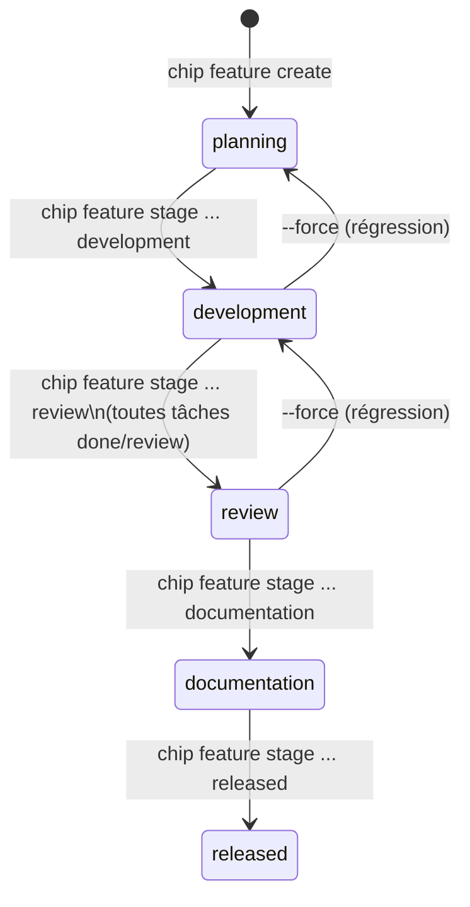
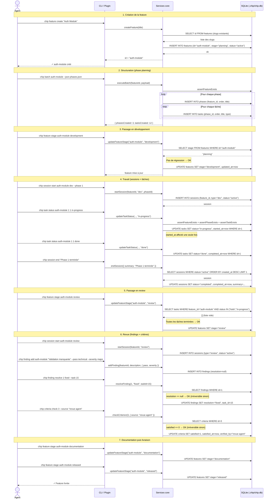

# Cycle de vie d'une feature

> Séquence complète d'une feature de `planning` à `released`, illustrant les interactions entre la CLI/plugin, les services core et la base de données.

---

## Vue d'ensemble du pipeline

---

## Flux complet — de la création à la livraison

---

## Règles critiques dans ce flux

| Étape | Règle |
|---|---|
| Création slug | Unicité garantie par `uniqueSlug()` — suffixe `-2`, `-3`… si collision |
| Passage à `review` | Bloqué si des tâches sont en `todo` ou `in-progress` (sauf `--force`) |
| `started_at` tâche/phase | Affecté une seule fois, lors du premier passage à `in-progress` |
| `completed_at` tâche/phase | Affecté à chaque passage à `done` (peut être écrasé) |
| Résolution finding | Irréversible — erreur si déjà résolu |
| Satisfaction critère | Irréversible — erreur si déjà satisfait |
| Régression de stage | Interdite sans `--force` |

---

## Commandes `chip next` tout au long du cycle

À n'importe quel moment, `chip next <feature-id>` retourne la prochaine action recommandée. Voir [flux/diagnostic-next.md](diagnostic-next.md) pour la logique complète.
