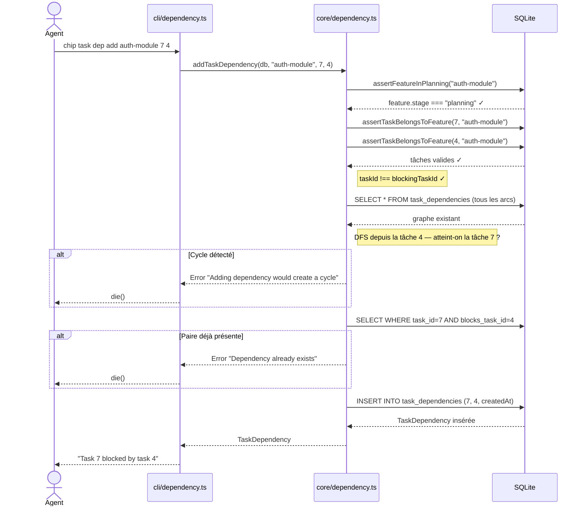
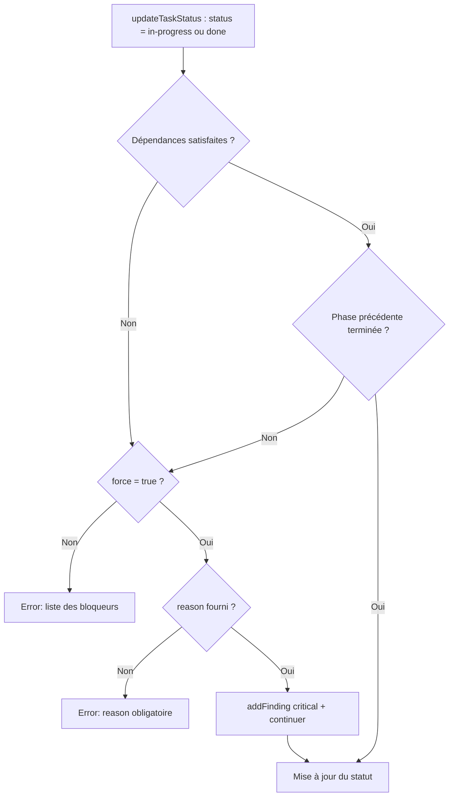
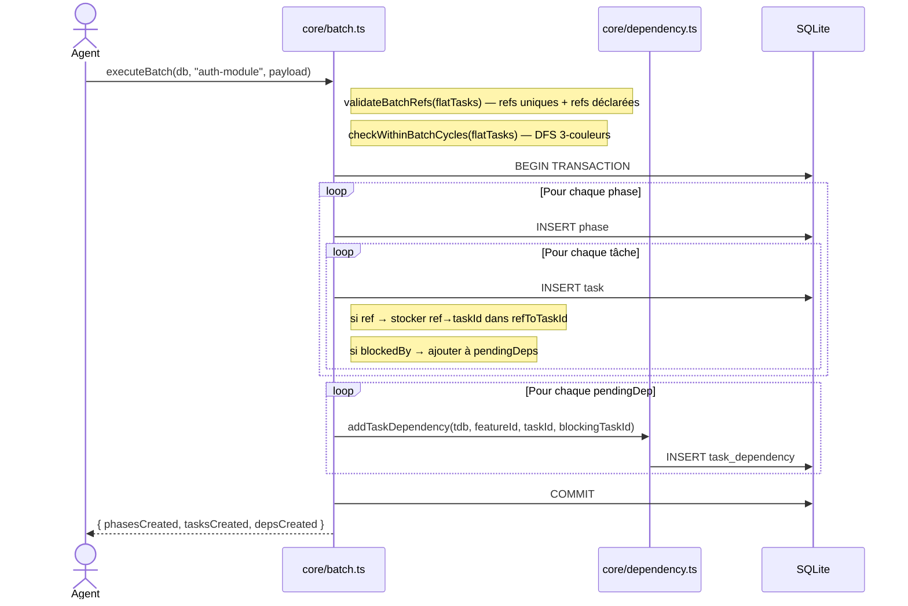

# Dépendances de tâches

> Logique implémentée dans `src/core/dependency.ts`.  
> Commandes CLI : `chip task dep add/remove/list` (`src/cli/dependency.ts`).  
> Outils plugin : `chip_task_dep_add`, `chip_task_dep_remove`, `chip_task_dep_list`.

---

## Rôle

Le système de dépendances permet de modéliser l'ordre d'exécution entre les tâches d'une feature. Une tâche **bloquée** ne peut pas passer à `"in-progress"` ou `"done"` tant que ses tâches **bloquantes** ne sont pas à l'état `"done"`.

En plus des dépendances explicites entre tâches, `updateTaskStatus` vérifie également l'**ordre des phases** : une tâche ne peut démarrer que si toutes les tâches de la phase précédente sont terminées.

---

## Contraintes et règles métier

| Règle | Comportement |
|---|---|
| Restriction au stage `planning` | `addTaskDependency` et `removeTaskDependency` lèvent une erreur si la feature n'est pas en stage `"planning"` |
| Appartenance à la même feature | Les deux tâches doivent appartenir à la même feature (vérifiée via `phase.featureId`) |
| Auto-dépendance interdite | `taskId === blockingTaskId` → erreur immédiate |
| Unicité de la paire | La paire `(task_id, blocks_task_id)` est unique en DB (index unique) |
| Détection de cycles | Un DFS complet est effectué avant chaque insertion ; un cycle → erreur descriptive |
| Cascade à la suppression | Supprimer une tâche supprime automatiquement toutes les dépendances la referençant (`ON DELETE CASCADE`) |

---

## Flux d'ajout d'une dépendance (`addTaskDependency`)



---

## Enforcement lors de `updateTaskStatus`

Quand une tâche passe à `"in-progress"` ou `"done"`, deux vérifications sont effectuées :

1. **Dépendances explicites** (`checkDependenciesSatisfied`) : toutes les tâches bloquantes doivent être `"done"`.
2. **Ordre de phase** (`checkPhaseOrderingSatisfied`) : toutes les tâches de la phase précédente doivent être `"done"` (si la tâche n'est pas dans la première phase).

Si l'une ou l'autre vérification échoue **et que `force` n'est pas activé**, une erreur est levée avec la liste des bloqueurs.



> **Note :** l'option `force` n'est **pas exposée** dans la CLI ni dans le plugin. Elle existe uniquement dans `updateTaskStatus()` au niveau du service core, pour permettre une réactivation future avec des garde-fous adaptés (approbation humaine, audit, etc.). En pratique, un agent qui rencontre une tâche bloquée doit signaler le blocage à l'utilisateur.

---

## Détection de cycles (algorithme DFS)

L'algorithme `detectCycle(db, newBlockedTaskId, newBlockingTaskId)` retourne `true` si l'ajout de la dépendance créerait un cycle :

1. Chargement de toutes les arêtes de `task_dependencies` en une seule requête.
2. Construction d'une map `taskId → [blockerIds]` en mémoire.
3. DFS à partir de `newBlockingTaskId` en suivant les arêtes `blockedBy`.
4. Si `newBlockedTaskId` est atteint : cycle détecté → erreur.

Cette approche permet la détection sans requête supplémentaire par sommet visité.

---

## Création de dépendances via `chip batch`

Le format batch accepte deux champs optionnels sur chaque spécification de tâche :

- `ref` : clé de référence unique dans le payload (string).
- `blockedBy` : liste de `ref` de tâches bloquantes **au sein du même batch**.

Les validations effectuées **avant toute insertion** :
1. Unicité de tous les `ref` dans le payload.
2. Existence de chaque `ref` référencé dans `blockedBy`.
3. Absence de cycles dans le graphe intra-batch (DFS 3-couleurs).

Toute la création (phases, tâches, dépendances) se fait dans une **transaction unique** : un échec à n'importe quelle étape annule l'ensemble.



---

## Affichage dans `chip feature status`

La commande `chip feature status` charge les dépendances de toutes les tâches de la feature en **deux requêtes batch** (via `getFeatureDependencyMap`) et les affiche sous chaque tâche :

```
Phase 1 — in-progress
  1.  ✓ done    Tâche A
  2.  ⏳ todo   Tâche B
                Blocked by: #1 Tâche A
  3.  ▶ in-progress  Tâche C
                Blocks: #2 Tâche B
```
