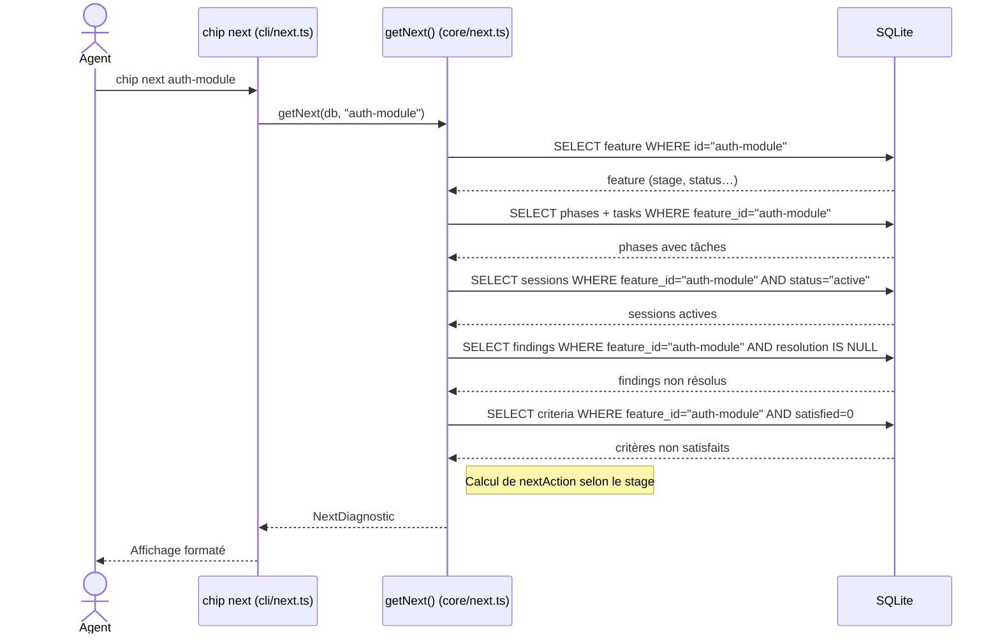
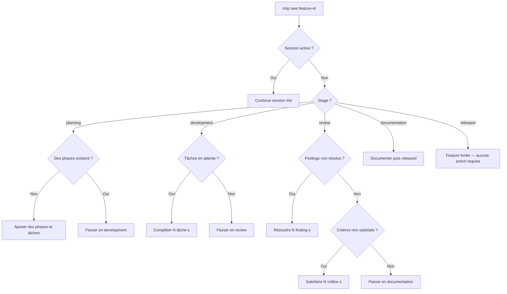

# Diagnostic `chip next`

> Logique de `getNext()` implémentée dans `src/core/next.ts`.  
> Exposé par `chip next <feature-id>` (CLI) et `chip_next` (plugin).

---

## Rôle

`chip next` fournit un diagnostic actionnable de l'état d'une feature : il indique exactement ce qu'il faut faire à l'instant présent, en tenant compte du stage courant, de la présence d'une session active, des tâches en attente, des findings non résolus et des critères non satisfaits.

---

## Structure retournée (`NextDiagnostic`)

```typescript
{
  feature: Feature,
  stage: string,
  activeSession: Session | null,
  pendingTasks: Task[],             // status "todo" ou "in-progress"
  unresolvedFindings: Finding[],    // resolution === null
  unsatisfiedCriteria: Criterion[], // satisfied === false
  nextAction: string                // message actionnable
}
```

---

## Flux de calcul



---

## Arbre de décision de `nextAction`

### Priorité absolue : session active

Si une session active est trouvée, elle prend la priorité sur toutes les autres règles :

```
activeSession != null
  → "Continue session #<id> (type: <type>)"
```

### Par stage (si aucune session active)

```
stage = "planning"
  ├── phases.length === 0
  │     → "Add phases and tasks to the feature (chip phase add / chip batch)"
  └── phases.length > 0
        → "Move feature to development stage (chip feature stage <id> development)"

stage = "development"
  ├── pendingTasks.length > 0
  │     → "Complete <N> pending task(s)"
  └── pendingTasks.length === 0
        → "Move feature to review stage (chip feature stage <id> review)"

stage = "review"
  ├── unresolvedFindings.length > 0
  │     → "Resolve <N> unresolved finding(s) (chip finding resolve)"
  ├── unsatisfiedCriteria.length > 0
  │     → "Satisfy <N> pending criterion/criteria (chip criteria check)"
  └── tout résolu
        → "Move feature to documentation stage (chip feature stage <id> documentation)"

stage = "documentation"
  → "Add documentation, then release (chip feature stage <id> released)"

stage = "released"
  → "Feature is released. No further action required."
```

---

## Diagramme de décision synthétique



---

## Ce que `chip next` ne fait pas

- Il n'émet pas de commande ni ne modifie aucune donnée — c'est une lecture seule.
- Il ne vérifie pas la cohérence entre le stage et l'état réel des tâches (ex. : tâches non terminées en stage `review`). Il se contente de signaler les éléments en attente.
- Il retourne toujours exactement un `nextAction`, même si plusieurs actions sont nécessaires (seule la plus urgente est retournée).
