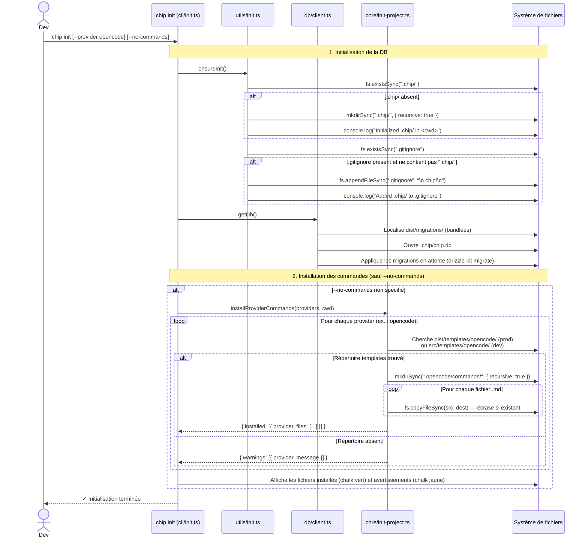
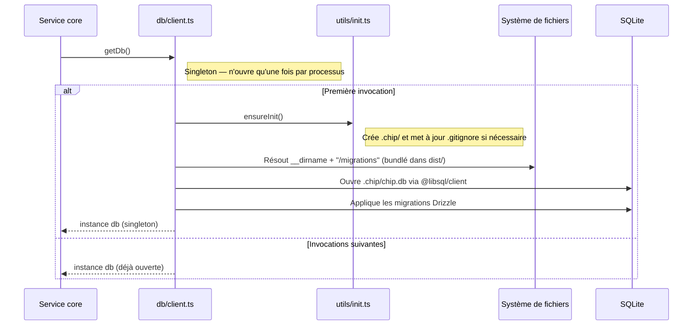

# Initialisation du projet

> Séquences déclenchées par `chip init` et par le premier appel à la DB.  
> Implémentées dans `src/cli/init.ts`, `src/core/init-project.ts`, `src/utils/init.ts`, `src/db/client.ts`.

---

## `chip init` — séquence complète

---

## `getDb()` — ouverture de la DB en production (CLI)

---

## `openDbForProject()` — ouverture par le plugin OpenCode

```mermaid
sequenceDiagram
    participant Plugin as plugin/index.ts
    participant DBClient as db/client.ts
    participant FS as Système de fichiers
    participant DB as SQLite

    Plugin->>DBClient: openDbForProject(input.directory, migrationsFolder)
    DBClient->>FS: Calcule <input.directory>/.chip/chip.db
    DBClient->>FS: mkdirSync("<input.directory>/.chip/", { recursive: true })
    DBClient->>DB: Ouvre la DB à cet emplacement
    DBClient->>DB: Applique les migrations
    DBClient-->>Plugin: instance db (non singleton — nouvelle instance par appel)
```

> Contrairement à `getDb()`, `openDbForProject()` crée une nouvelle instance à chaque appel. C'est le plugin qui gère le cycle de vie de la connexion.

---

## Résolution du répertoire templates

`installProviderCommands()` localise les templates par deux chemins successifs :

1. `__dirname + "/templates/<provider>"` — chemin de production (dans `dist/templates/`).
2. `__dirname + "/../templates/<provider>"` — chemin de développement (depuis `src/core/`).

Si aucun des deux chemins n'existe, un avertissement est retourné (pas d'erreur fatale).

---

## Récapitulatif : ce que crée `chip init`

| Élément | Emplacement | Condition |
|---|---|---|
| Répertoire `.chip/` | `<cwd>/.chip/` | Toujours |
| Base de données | `<cwd>/.chip/chip.db` | Toujours |
| Entrée `.gitignore` | `<cwd>/.gitignore` | Si `.gitignore` existe et ne contient pas `.chip/` |
| Commandes OpenCode | `<cwd>/.opencode/commands/*.md` | Sauf `--no-commands` |
